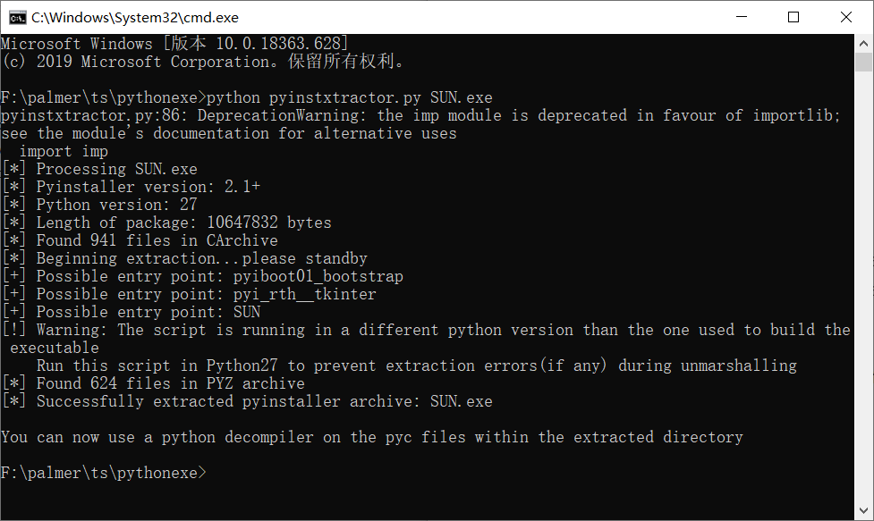
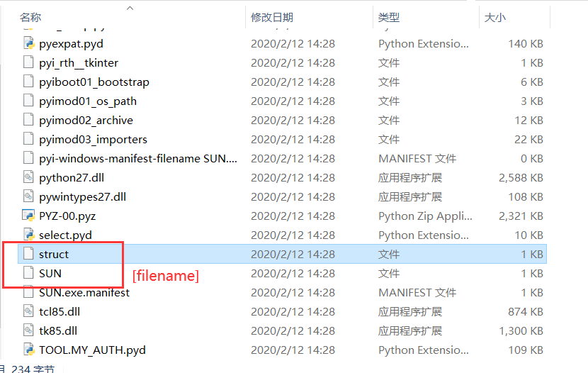
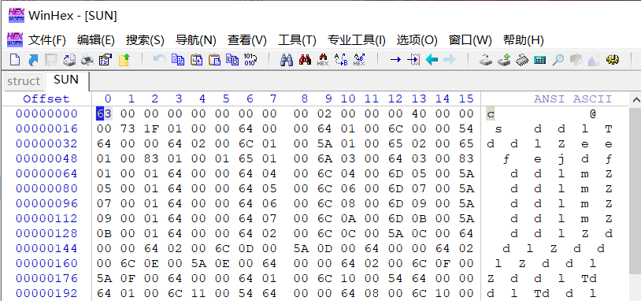
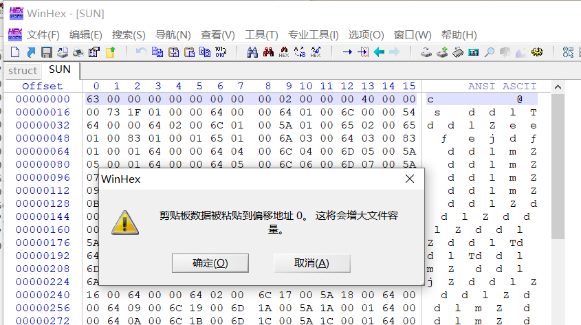
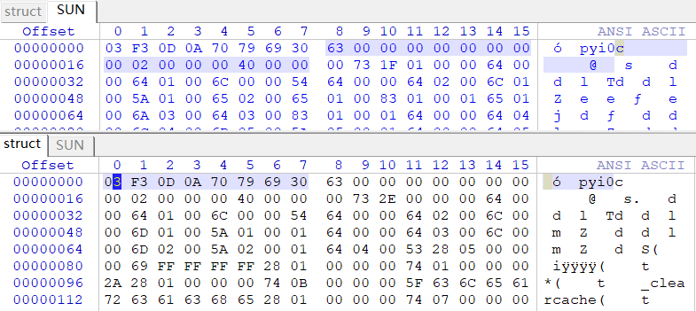

> 原帖地址：https://www.52pojie.cn/thread-1102117-1-1.html

# Py_decompiling

将python编译成的exe文件反编译为py文件

1. uncompyle6

   将pyc反编译为py文件

2. `archive_viewer.py`文件

   将exe反编译为pyc文件

   使用方法 cmd命令

   ```bash
   python archive_viewer.py [filename]
   ```

3. `pyinstxtractor.py`文件 [extremecoders-re/pyinstxtractor: PyInstaller Extractor (github.com)](https://github.com/extremecoders-re/pyinstxtractor)

   将exe反编译为pyc文件


有`-key`参数Pyinstaller逆向：[[原创\]Python逆向——Pyinstaller逆向-软件逆向-看雪论坛-安全社区|安全招聘|bbs.pediy.com](https://bbs.pediy.com/thread-271253.htm#msg_header_h1_2) | [Frequently Asked Questions · extremecoders-re/pyinstxtractor Wiki (github.com)](https://github.com/extremecoders-re/pyinstxtractor/wiki/Frequently-Asked-Questions)

## 使用步骤

以文件`SUN.exe`为例

### 将exe反编译

使用`pyinstxtractor.py`将exe文件反编译
将`pyinstxtractor.py`放入exe所在目录。
使用方法：cmd窗口输入：
```bash
python pyinstxtractor.py [filename]
```
如例子：



反汇编的文件夹存放在同目录下`[filename]_extracted`目录中

### 修改使之符合pyc文件pe头

进入`[filename]_extracted`目录



找到这两个文件，使用winhex打开，（以SUN.exe为例）



找到[filename]文件最开头的一字节。


找到struct与之相同的一字节。
将struct前面的复制粘贴到[filename]的文件头（此文件是前8字节）




粘贴完之后



然后使用Winhex将[filename]另存为pyc文件（手动添加.pyc后缀）

（以上步骤仅反编译主py文件。多个py文件，多余的pyc文件在`[filename]_extracted`目录的`PYZ-00.pyz_extracted`目录里）

### 使用uncompyle6将其反编译为py文件