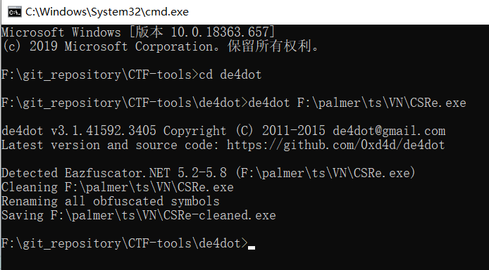

# de4dot

> 原GitHub项目地址：https://github.com/0xd4d/de4dot

.NET程序解混淆器和解压缩器


# 简单使用

示例程序`F:\palmer\ts\VN\CSRe.exe`

先进入`de4dot`目录，打开cmd窗口

执行命令

```bash
de4dot F:\palmer\ts\VN\CSRe.exe
```



会在 需要反混淆的程序目录 生成一个`<filename>-cleaned.exe`

